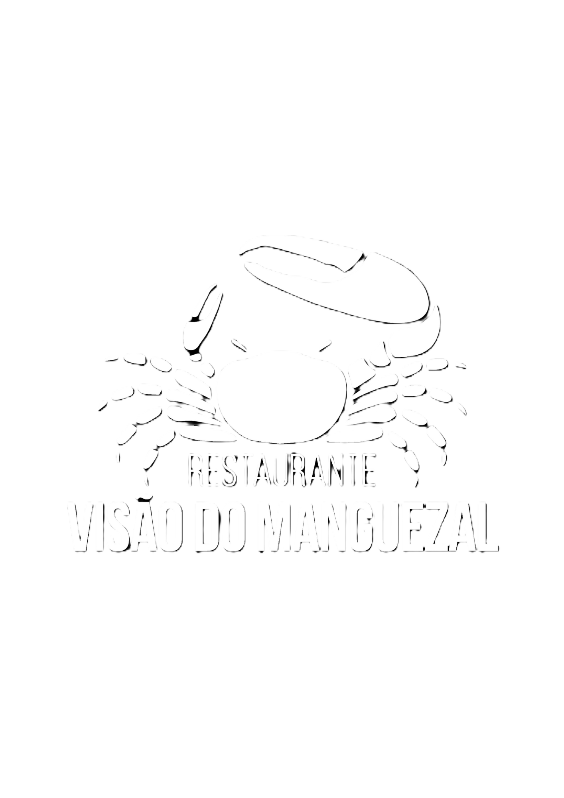

# Restaurante Visão do Manguezal

## Sobre o Projeto

Desenvolvimento de um site que faciite os pedidos de marmita e tambem as reservas de eventos, ajudando na organização de cada coisa.

## Integrantes

 - CECÍLIA FIGUEIREDO COMBAT - figueiredoceci2004@gmail.com
 - RENATA AROUCA SANTOS - renata.santos.valenca@uniatenas.edu.br

## Como Usar

Este projeto foi desenvolvido utilizando o framework Flask, executado no Visual Studio Code (VS Code). As linguagens de programação utilizadas incluem Python para a lógica de backend, HTML para a estrutura das páginas web e CSS para a estilização.

## Pré-requisitos

Certifique-se de ter o Python e o Virtualenv instalados em sua máquina. Você também precisará do Visual Studio Code como seu ambiente de desenvolvimento integrado (IDE).

## Passo a Passo para Configuração e Execução

1. **Clone o Repositório**

    Clone este repositório para sua máquina local:
   https://github.com/Ceciliacombat/Restaurante_visao_manguezal.git

2. **Crie e Ative um Ambiente Virtual**
  Navegue até o diretório do projeto e crie um ambiente virtual:

      cd Restaurante_visao_manguezal
      python -m venv venv

      **Ative o ambiente virtual:**

      No Windows: venv\Scripts\activate ou .\venv\scripts\activate 

      No macOS/Linux: source venv/bin/activate

3. **Instale as Dependências**

      Instale as dependências do projeto listadas no arquivo requirements.txt: 

      pip install -r requirements.txt

4. **Configuração do Banco de Dados**

      Configure o banco de dados conforme necessário. Execute as migrações para criar as tabelas no banco de dados:

      flask db upgrade

5. **Execute a Aplicação**

      Com todas as dependências instaladas e o banco de dados configurado, você pode executar a aplicação Flask:

      flask run

      A aplicação estará disponível em http://127.0.0.1:5000/

      ## Estrutura do Projeto
app.py: Arquivo principal para inicialização da aplicação Flask.

/templates: Contém os arquivos HTML renderizados pelo Flask.

/static: Contém os arquivos estáticos como CSS e imagens.

/models: Definições dos modelos de dados.

/routes: Definição das rotas da aplicação.

## Funcionalidades Principais
Cardapio: Para que os clientes possam olhar as opções de comida de um jeito mais prático 

Formulários de Marmita e Prato feito: Para que os clientes possam pedir a comida sem precisar ficarem ligando ate conseguir falar com o local e somente irem retirar a refeição na loja.

Reserva de Eventos: Local onde os clientes possam reservar seus eventos sem nenhuma difuculdade.

Ambiente Admin: Local onde os responsáveis poderão ter o controle das reservas e pedidos de comida. 

Entregas de delivery (em construção)

## Tecnologias Utilizadas
Flask: Framework web usado para o desenvolvimento do backend.

Python: Linguagem de programação principal para a lógica do servidor.

HTML/CSS: Para estruturação e estilização das páginas web.

JavaScript: Para funcionalidades interativas e dinâmicas no frontend.

SQLite: Banco de dados utilizado para armazenar informações.

## Conclusão

Seguindo esses passos, você estará pronto para utilizar e explorar todas as funcionalidades do projeto Restaurante_visão_manguezal.

Se precisar de mais ajuda, consulte a documentação do Flask ou entre em contato com um dos integrantes do projeto.

